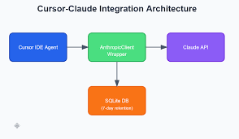

# AI Text Analyzer - Cursor.ai Project


## Overview
A powerful text analysis application built with Python and Cursor.ai integration, providing advanced text processing capabilities and AI-powered analysis.

## Project Structure
```plaintext
DEMOAPPCursor/
├── backend/
│   ├── app.py          # Main application logic
│   ├── main.py         # Entry point
│   └── requirements.txt # Python dependencies
├── cursor1.png         # Project logo/screenshot
├── .gitignore         # Git ignore rules
└── package-lock.json  # Node.js dependencies lock file
```

## Features
- AI-powered text analysis
- Python backend with robust processing capabilities
- Modern and efficient implementation
- [Add your specific features here]

## Prerequisites
- Python 3.8+
- Node.js and npm (for frontend dependencies)
- Git

## Installation

1. Clone the repository
```bash
git clone https://github.com/Manobhiramlol/AI-Text-Analyser-Cursor.ai.git
cd AI-Text-Analyser-Cursor.ai
```

2. Set up Python virtual environment
```bash
# Navigate to backend directory
cd backend

# Create virtual environment
python -m venv venv

# Activate virtual environment
# On Windows:
venv\Scripts\activate
# On macOS/Linux:
source venv/bin/activate
```

3. Install Python dependencies
```bash
pip install -r requirements.txt
```

4. Install Node.js dependencies (if applicable)
```bash
npm install
```

## Usage
1. Start the backend server:
```bash
cd backend
python main.py
```

2. [Add additional usage instructions here]

## Development
- Follow PEP 8 style guide for Python code
- Use meaningful commit messages
- Create feature branches for new development

## Contributing
1. Fork the repository
2. Create your feature branch (`git checkout -b feature/AmazingFeature`)
3. Commit your changes (`git commit -m 'Add some AmazingFeature'`)
4. Push to the branch (`git push origin feature/AmazingFeature`)
5. Open a Pull Request

## Screenshots


## Contact
- Developer: [@Manobhiramlol](https://github.com/Manobhiramlol)
- Project Link: https://github.com/Manobhiramlol/AI-Text-Analyser-Cursor.ai

## License
[Choose an appropriate license]

## Acknowledgments
- Cursor.ai for providing the AI capabilities
- Contributors and testers

---
Last updated: 2025-06-11 14:50:10 UTC